<!-- Generated by scripts/observatory.mjs — edit scripts/content.mjs, not this file. -->

  

  
  

  

  
  
  
  

  
  

  
  
  
  
  
  
  
  
  

  

  

  

✦ <b>AI 使用说明</b> · 我在工作中（包括代码与 PR）可能会使用 AI 辅助，但所有内容都经过本人严格审查和阅读，确认理解后才提交，并由本人对结果负责。

